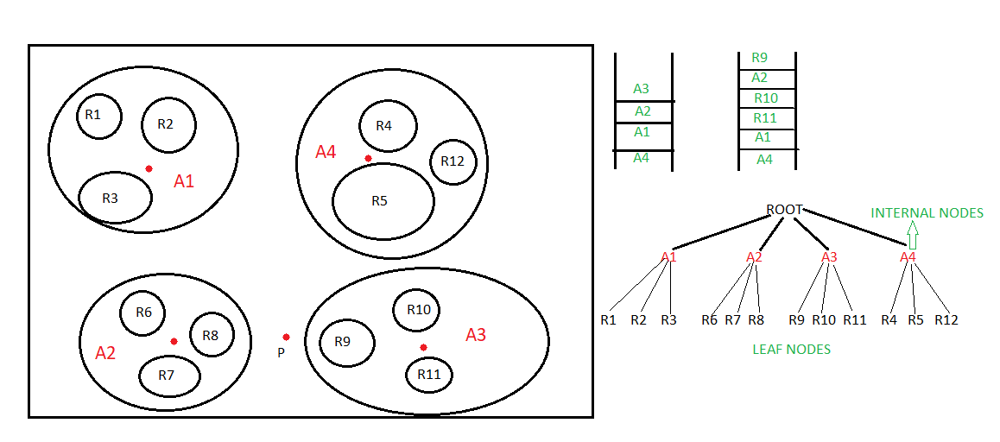

# Scalable Nearest Neighbour Algorithms for High Dimensional Data
- This repository contains code for optimization of KNN using k-means culstering and k-d trees
- [this](http://ieeexplore.ieee.org/stamp/stamp.jsp?tp=&arnumber=6809191) and  [this](http://ieeexplore.ieee.org/stamp/stamp.jsp?tp=&arnumber=4587638&tag=1) research papers has been implemented in order to achieve this optmization

## Implementation Summary
- K-nearest Neighbour(KNN) algorithm is used for supervised learning. KNN algorithms time complexity for finding nearest neighbours for n points is `n^2` .But there is a way to reduce time complexity of this algorithm to n log(n) using K-D trees and K-means clustering. 
- But because of reduced time complexity we will be able to find approximate nearest neighbours but not exact nearest neighbours.
- Still in large(rael life) clusters of data, approximate nearest neighbour is as good as exact nearest neighbour.

## Algorithms implemented: 
- Nearest Neighbour with single KD search tree
- Fast approximate NN with Randomized K-D tree algorithm
- Fast approximate NN(Nearest Neighbour) Clustered K-Means tree.

### Nearest neighbour with single KD search tree:
- This algorithm uses KD trees and priority ques in implementation. KD trees are used to store N-dimensional points just like binary search trees do for 1 dimensional points. In this algorithm if there are n dimensions in a given data then depending on the depth of tree we decide which point to compare to go left or right of tree. Please read about these [here](https://www.geeksforgeeks.org/k-dimensional-tree/) for further clarification.

- In above image we can see that every left and right of a node divides the n dimensional space into two parts. In the same way as we go down we get we reach the cell containing the approximate nearest neighbour. If we consider the below image we can observe that nearest neighbour to green point is not in the same cell. So, this method may not every time provides the nearest neighbour. Look in the next image

- You can have a look at randomized_multiple_kdtree.py for further details of implementation. I have commented every function appropriately.

__Parameter tuning and their effect on time complexity :__
- We can set the number of nodes of tree the algorithm checks for nearest neighbour before stopping. However in first attempt we most probably reach the nearest neighbour but there is a chance of exception as in above figure. Increasing the number will most probably give good results. But this process will increase searching period
- To overcome this problem we can use randomised K-D tree algorithm.

### Fast approximate NN with Randomized K-D tree algorithm:
- In this algorithm we use multiple K-D trees for prediction and this method helps in finding better results than single K-D tree. Let us consider this image for better understanding.

| Randomness 1  | Randomness 2 |
| ------------- | ------------- |
|   |   |

- Let us consider that above two figures are two trees formed when altered the order of data during construction of tree. In first figure point q and its nearest neighbour are separated by blue line and in figure 2 the is no separation between it means tree from second figure predicts correct nearest neighbour. 
- Now let me prove why multiple trees give better results. Let us consider two points and if I draw line in space then the probability of that line passing between two points(given point and its nearest neighbour) is much less then not passing between them. In the same way if there are n randomized K-D trees with different configuration then according to probability only few of those trees separate the query point and its nearest neighbour so when we consider result of multiple K-D trees then most probably we get nearest neighbour. 
- Now there is one more luxury with this algorithm we can process this in parallel and I mean we can use a common priority queue for all the different trees and run searching for nearest neighbour in all the trees in parallel. This is extremely while data is too large to handle in a single computer or system.\

__Parameter tuning and their effect on time complexity:__
- We can set number of nodes to search before stopping ,same as single n-KD tree, we can decide number of trees to use using large number will not improve accuracy at the same time single tree may not perform best. Greater the number of trees more time for computation is required.   

### Fast approximate Nearest Neighbour with Clustered K-Means tree:
- In this algorithm we use K-Means cluster for clustering the data initially and then we make mid points of these K clusters as child nodes of K-ary tree and then recursively continue process till number of points in a cluster is less than K and when this happened we make a leaf node at that position and push all points into that node. So, all the original points are present in the leaf nodes of tree. 
- See the picture for better understanding. It is a bit messy please adjust 😊.

-In this figure let p be a point ,an a four-ary tree and let us consider that point p is a little close to area A3 now we traverse all child nodes(A1,A2,A3,A4) of root node in tree and push the root nodes into priority queue according to distance of the points to the centre of areas(A1,A2,A3,A4) .you can see that areas are adjusted according to their distance in priority queue and next we visit top element of priority queue(A3) and then child nodes of A3 are added to priority queue so first priority queue is modified to second priority queue  with top element R9 and second element as A2 as A2 is second nearest point to P after R9 and this process continues till we reach leaf nodes where original points are present . These points in leaf nodes will give the nearest neighbour. If we reach more leaf nodes then we will have a greater change to get the best nearest neighbour. At the same time reaching every root node is also useless.

__Parameter tuning and their effect on time complexity:__
- We can set number of comparisons same as above two algorithms 

*__Number of clusters:__* This value decides number of child to each node of tree. Larger value will increase accuracy and tree building time because on every recursion we need to make more cluster and decreases height of tree.

*__Number of iterations during clustering:__* Increasing the number of iterations make better clusters with increasing accuracy. But accuracy saturates at certain iteration level and hence there won’t be any improvement after that. So, this value should be chosen carefully for good results and reduce time complexity
